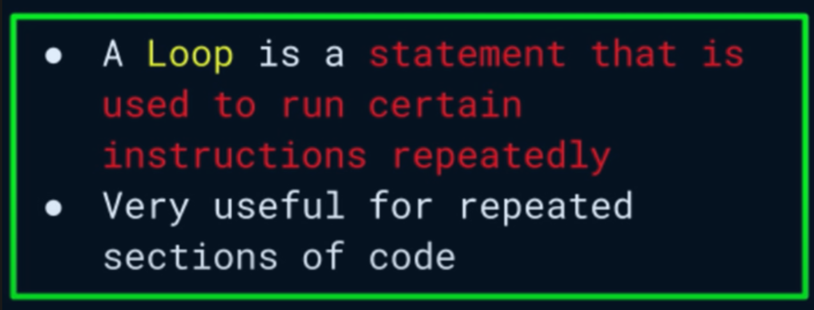

# Week 10

The [review video is actually our most recent help session.](https://around.co/playback/e36032a3-f2dd-42a0-9aeb-20af5b5bf97a?sharedKey=7317627f-b0d6-440c-ae72-13b8e8428a94) This video is optional. If you had trouble last week, you should at least scrub this video.

## Loops

Let's learn about ➿s.
Let's learn about ➿s.
Let's learn about ➿s.
Let's learn about ➿s.
Let's learn about ➿s.......



💻s are great for repeating mundane tasks tirelessly without making mistakes - unlike humans 🧑‍🤝‍🧑.

### `for`

If we want to run something a specific number of times, we can use `for`. `for` usually needs 3 pieces of information to run 🏃🏽‍♂️:

1. Where do you want to start? We can use `let` to create a _variable_ to keep track of this: `let i = 0;` (`i` is just a made up name).
2. When do you want to end? We can set some _conditional_: `i <= 10;` Keep going until `i` reaches `10` (_boolean_).
3. How much do you want to _increment_ by each time? If we don't update `i`, we'll never reach `10`, and our program will be stuck in an infinite loop. So, to increase `i` by `1` each time, we can do: `i+= 1`. This will throw out the current _value_ of `i` add `1`, and _assign_ that new _value_ to `i`.

Putting all together now:

```js
// for (some initial condition; some ending condition; some increment interval)
for (let i = 0; i <= 10; i += 1) {
  // Do something
}
```

Notice the similarity between this syntax and what we saw with if. We have a _keyword_ `for`, followed by a set of _parentheses_ `()`, and a set of _curly braces_ `{}`. The _parentheses_ contain the _initial condition_, the _ending condition_, and the _increment interval_ separated by _semicolons_ `;`.

### `while`

Useful if we don't know how many times we want to run 🏃🏽‍♂️the _loop._ Just keep doing `while` some condition is `true`.

```js
let i = 0;

while (i <= 10) {
  // DO SOMETHING
  i += 1; // This is shorthand for i = i + 1;
}
```


While the number has a value that’s lower than 10, the statement gets executed. The statement is myNumber+= 1, which increases the value of myNumber on every execution. The last number where the condition would return true, is if myNumber = 9. myNumber then gets incremented one more time, which makes it 10. The condition is now false, and the loop stops.

## FIRST PART of Homework Due Tuesday

Write a program that prints the numbers from 1 to 100. But for multiples of three print “Fizz” instead of the number and for the multiples of five print “Buzz”. For numbers which are multiples of both three and five print “FizzBuzz”.

Do this for with **both** a `for` and a `while` loop.

Hint: You'll need to use the modulo operator `%` to determine if a number is divisible by another number. For example, `3 % 3` is `0`, but `4 % 3` is `1`.

Record an explanation of your code and how it works. Share the video in BrightSpace. Continue to use the same repository you have been using for your homework (`js-first-blood`). Create a new file called `fizzbuzz.js` and put your code in there. Remember that you need to run `node fizzbuzz.js` to run your program. You can either make separate commits for each part of the HW (make sure that I can clearly read the message and know where to look), or you can make 2️⃣ files, say, `fizzbuzz-for.js` and `fizzbuzz-while.js`.

## Looping Over An Array

```js
const groceryList = ["Apples", "Bananas", "TP", "Bars", "Wacon", "🥚s"];

console.log(groceryList[0]); // Apples
console.log(groceryList[1]); // Bananas
console.log(groceryList[2]); // TP
console.log(groceryList[3]); // Bars
console.log(groceryList[4]); // Wacon
console.log(groceryList[5]); // 🥚s
```

😬. That's no good! How can we do better? Think 🤔 before reading further!

---

We can use loops to iterate over an array.

```js
const groceryList = ["Apples", "Bananas", "TP", "Bars", "Wacon", "🥚s"];

// 'log' every item on the list...
/**
 * The first INDEX is...'0'
 * The last INDEX is...1 less than then length of the Array.
 * There are total items...the LENGTH is 6.
 * The last INDEX (🥚s) is...'5'
 *
 * If we write a 'for' that starts at '0' and stops at the LENGTH - 1...
 *
 * To get that LENGTH, we just have to access the name of that ARRAY and add a '.length' - 'groceryList.length'
 */
for (let i = 0; i < groceryList.length; i += 1) {
  // 'i' will ITERATE from '0' to '5', INCREMENTING by 1 each time...
  console.log(groceryList[i]);
}

// 'i' here is in the GLOBAL SCOPE - it has nothing to do with the 'i' mentioned in the 'for' 👆🏽
let i = 0;

while (i < groceryList.length) {
  console.log(groceryList[i]);
  i += 1;
}
```


The above explanation is taken from some content written by 1️⃣ [Lydia Hallie.](https://www.theavocoder.com/)

## SECOND PART of Homework Due Tuesday

Given the following array of numbers: `const numbers = [1, 2, 3, 4, 5, 6, 7, 8, 9, 10];`, write a ➿ that only `log`s the even numbers in the array.

You can do this with whichever ➿ that you prefer. Once again, I'll need an accompanying video code walkthrough. You may continue using the same repo. Create a new file called `even-numbers.js` and put your code in there. Remember that you need to run `node even-numbers.js` to run your program.

---

## First Part of HW Due Thursday

Once again, you'll use your `js-first-blood`.

Start by pasting the following code into your `index.js`:

```js
const person = {
  name: "John",
  age: 17,
};

function verifyAdulthood(personName, personAge) {
  if (personAge >= 18) return `Welcome, ${personName}!`;

  return `You are not old enough to enter, ${personName}.`;
}

const adultMessage = verifyAdulthood(userName, userAge);

console.log(adultMessage);
```

The code is broken. Fix it. DO NOT change the `person` object except to change the age to make sure that it still works. The purpose of this assignment is to make sure that you understand how to pass arguments to functions and how to access object properties.

Create another video to explain what you did and why you did it. Share the video in BrightSpace.

## Second Part of HW Due Thursday

Make sure that the previous work is committed and pushed to your repo, as we will be building on it.

```js
const people = [
  {
    name: "John",
    age: 17,
  },
  {
    name: "Jane",
    age: 20,
  },
  {
    name: "Mary",
    age: 25,
  },
  {
    name: "Peter",
    age: 30,
  },
  {
    name: "Paul",
    age: 35,
  },
];

function verifyAdulthood(personName, personAge) {
  if (personAge >= 18) return `Welcome, ${personName}!`;

  return `You are not old enough to enter, ${personName}.`;
}

// TODO: Use a loop to call the verifyAdulthood function for each person in the people array.
```

DO NOT change any of the existing code. Just add your code to replace the `TODO`.

You will need to add a loop (whichever) to call the `verifyAdulthood` function for each person in the `people` array. You will need to use the `name` and `age` properties of each object in the `people` array as arguments to the `verifyAdulthood` function.

Here's the example output:

```shell
You are not old enough to enter, John.
Welcome, Jane!
Welcome, Mary!
Welcome, Peter!
Welcome, Paul!
```

You do not need to make a video for this part of the homework. Just make sure that you commit and push your changes to your `first-blood` repo.
