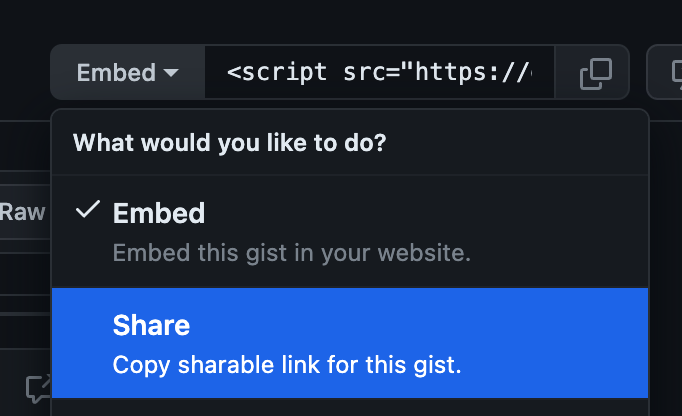
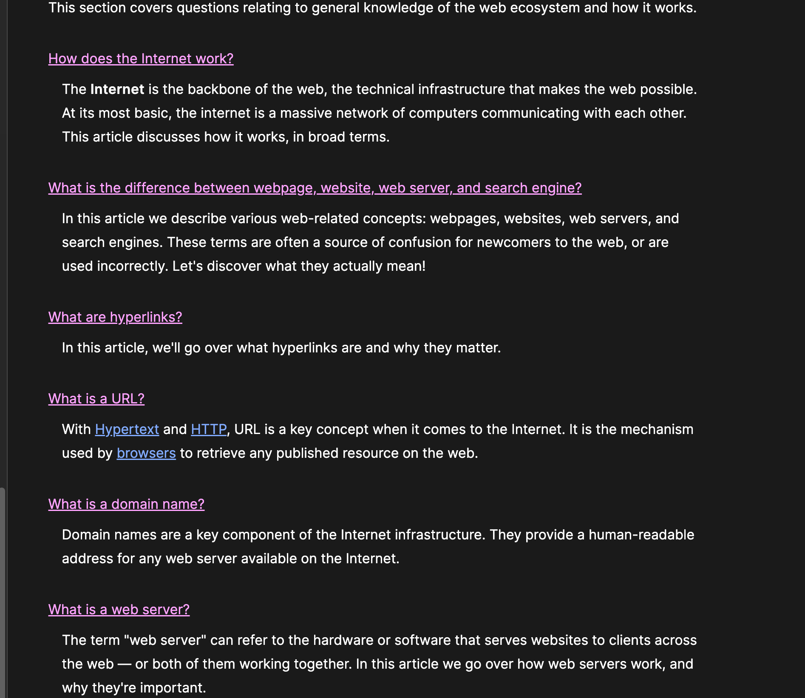

# Week 3️⃣

**Note:** This starts on Wednesday, 1/31 because we extended last week to be due on Tuesday.

## Homework Review

1. Watch this [video](https://somup.com/cZVtblk8Xn) as it shows how to use `branch` and `switch`. This was not part of the HW assignment, but it is good to know. We use `git switch -c` to Create and **switch** to a new **branch.** We use `git switch` to switch to an existing branch. We use `git branch` to see all of our branches.
1. In this [video](https://somup.com/cZVtbTk8XO), I mention a specific mistake that I see many 🧑‍🎓s make regarding ` ` tags.

## How Do Computers Work?

1. Watch this video on [How Computers Work](https://youtu.be/mOu1N7uTXyg?si=xKq2K9ZyLgA8aBQI).

### Homework Assignment (Due Thursday, 2/1)

Create a GitHub Gist (remember to have the file extension be `.md`) and summarize 3-4 things that you learned from the video. Submit the link to this file in BrightSpace. Be sure to share using:

, not the 'Embed' option.

## Homework Assignment (Due Saturday, 2/3)

[This video](https://somup.com/cZVt30k8qd) refers to [the materials from MDN.](https://developer.mozilla.org/en-US/docs/Learn/Common_questions/Web_mechanics)

. Ok, just answer the questions in your own words. This is to be **a video submission** via BrightSpace. You are to pretend that you are being asked these questions in an interview situation. You video should be 3-5 minutes long, but no longer than 10 minutes, please.

In addition, I want you to highlight specifically in the MDN materials where you got your information from. This can be done via screenshots or maybe just a MarkDown list of links, like a list of sources. The point is that I want your information to come from these materials specifically that are assigned. I don't just want you to Google or ChatGPT your answers.

---

## GitHub Copilot

This is not really HW but it would be foolish for you **not** to get this!

Here's a [demo of GitHub Copilot with the Chat.](https://somup.com/cZnnrepfb1)

You can [apply to get it for free as a 🧑‍🎓](https://docs.github.com/en/education/explore-the-benefits-of-teaching-and-learning-with-github-education/github-global-campus-for-students/apply-to-github-global-campus-as-a-student#applying-to-github-global-campus)
