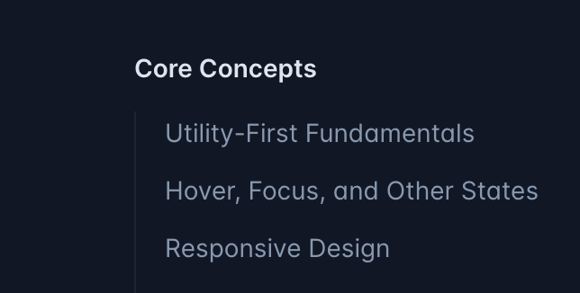

# Week 4️⃣

## Homework Review

You were to learn about _How Computers Work._ Whenever we do these types of assignments, I'm expecting well-formatted MD and some type of personal comments, feedbacks or perspectives. It's important to develop this habit or trying to relate facts and figures to things in your life or things that you know. This is a skill that will help you in your career and help you make an impression during interviews. Just repeating facts and figures is not enough. You need to show that you understand them and can relate them to your own experiences. Hence, we call them 'reflections 🪞.

Basically, if you did anything like that at all, you got full credit. If you didn't followed procedures from previous weeks and **share** a Gist link instead of Zips, screenshots or embeds, I docked a couple of points.

Yes, I realize that BrightSpace requires an actual file to submit as well. 🤷🏾‍♀️

All of the above applies especially to your 'pre-recorded' interview questions, which was the other part.

Finally, some of you were to resubmit your HTML-CSS projects by doing some additional works, **adding,** **committing** and **pushing.**

## Review of Tools and Clarification on `npm`

In this 'office hours' style video, I work with one of our fellow learners to clarify some of the concepts we've been working with. We also talk about `npm` and how it works.

Here are some things to be listening for as you watch:

- What is the terminal? What are some synonyms for it?
- What is the prompt?
- What is a directory?
- What is `cd`?
- What is `npm`? What does it stand for? What is it used for?
- What file must be present for `npm` to work? (Manifest file)
- How do we add a script to `package.json`?
- How do we install a package? Why would we want to do this?
- What is Vite?

[Office Hours](https://around.co/playback/aced3c57-2ec5-4573-9436-bede6a289113?sharedKey=d1a51c4a-0b26-4e3d-9624-7651544f2d05)

[This video](https://somup.com/cZnebbpfJX) pretty much picks up where the last left off.

[This 1️⃣ wraps up the review.](https://somup.com/cZneb0pfJO)

Other than that, you just:

1. Perform a logical unit of work (like adding a new feature or fixing a bug).
2. Add, commit and push your changes. You can do these things from VS Code or from the terminal. It's up to you.

Just remember about writing some quality commit messages. Such as: "Add a new feature to the landing page" (actually mention what that feature is) or "Fix the bug in the contact form" (actually mention what the bug was).

## Homework Due for Thursday (30 points)

You'll want to add to your 'Reflections 🪞' document. You can create a new MD file there, or just add to what you have and/or just create a Gist (make sure to share it correctly and keep the `.md` extension).

Review the above videos. As a bare minimum, give detailed answers to the questions posed above. For full credit, give some genuine reflections.

- What does it all mean to you?
- Does it make sense (really)?
- Can you imagine how these tools might be useful to your future 'real work?'
- What don't you like about it? If you could change something, what would it be?

Mixin your analogies, feelings, examples, etc. Anything you can do to make it more personal and relatable. This makes it more valuable to you and I certainly don't want to read 20+ regurgitations 🤮 of the same boring facts. Google and ChatGPT can already do that!

As always your MD should reflect good use of headings, paragraphs, lists, etc. Whatever is appropriate for the content. It should be well-formatted and easy to read. It should be reasonably free of spelling and grammatical errors. You can always us ChatGPT to help with that part of it, but the information comes from you and the time you spend watching and reflecting.

Generally, if I get the impression that you just slopped some 💩 together at the last minute I'm going to slash 🔪 your score 👿. Unfortunately, that's what happened on the last round of reflections for a few folks 👎🏾.

## Tailwind CSS

I barely remember how to write 'vanilla CSS 💄.' With all of the braces and semicolons and switching around between HTML and CSS files...nope, couldn't be me! Enter Tailwind.

Tailwind doesn't replace knowledge of CSS 💄. You still need to know it and how it works. But, it does save the tedium and time of writing it out from scratch.

It's a utility-first CSS framework. This means that it's designed to be used directly in your HTML. You don't have to switch back and forth between HTML and CSS files. You can just write your styles right in your HTML.

1. [Tailwind Overview](https://somup.com/cZneFfpfds)
1. [Tailwind Docs 📝](https://somup.com/cZneFIpfK2)

## Homework Due For Saturday (10 points)

The [Tailwind docs 📝](https://tailwindcss.com/docs/installation) has a lot in it. I want you to focus first on the pages shown here:

Write a reflection (as usual) on your initial thoughts and reactions to all of this. Again, you don't need to go through all of it, but do enough to get a sense of it. Be curious - that's a 🔑 to becoming a successful developer!

Next, start going through at least 5-10 of the various parts of the documentation where they cover the various example classes and how they wor,

You can pick and choose, but I want to see that you've been through a variety of things. You can do more if you like, but 5-10 is the minimum. Definitely explore the common things that you've already used like `flex`, `grid`, `text`, `bg`, etc. But, also try to find some things that you haven't used yet.

From said docs, give examples (basically just copy from the docs) and explain your understanding. Do you understand the underlying CSS? When do you think you might use whatever classes you just chose? In your HTML-CSS project, can you envision where you will end up refactoring ♻️ away some of your CSS 💄 and use these Tailwind classes install? Don't actually make the changes yet as that will be a separate HW!

---

These types of 'reflections' assignments are all about effort and completeness. Convince me that you really did make the genuine effort to challenge yourself and to learn. Again, your own perspectives and thoughts are what I'm looking for. I'm not looking for a regurgitation of the docs. I'm looking for your thoughts and feelings about the docs and the concepts they cover.
