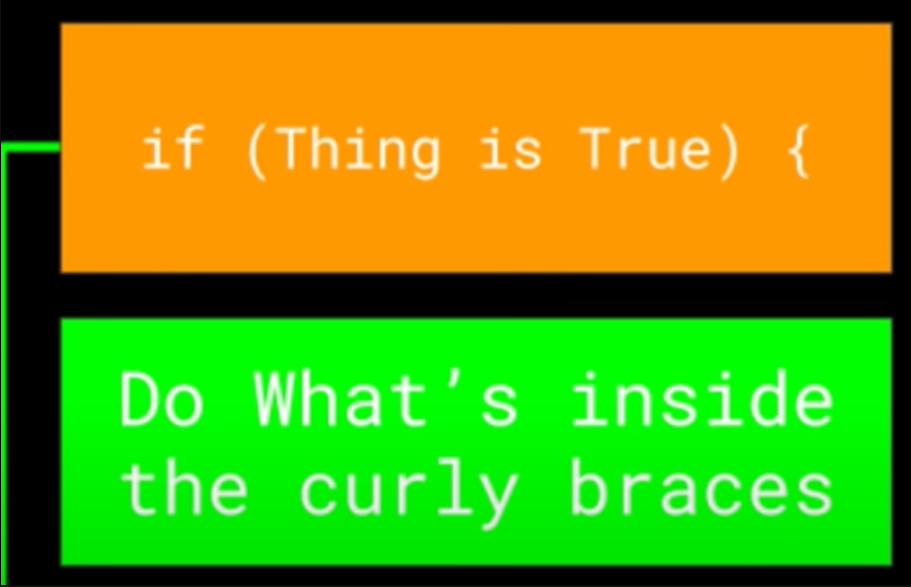
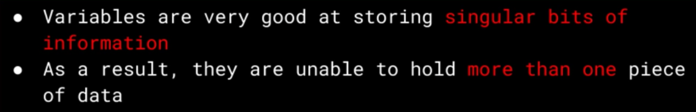

# Week 9

Unless otherwise noted, images are taken from an old Free Code Camp course on Computer Science fundamentals.

## ES Lint Configuration Update 🔧 (Optional)

I [have **pushed** an update up to the `node-template` repository.](https://github.com/SWIC-177/node-template/commit/db8a8053dd04ad87471a3b2477befd9bee6bcdfe) This means that any upcoming JS repositories that are based on this template will have the updated configuration.

However, if you wish to make the update from your side on `js-first-blood` or any other repository, you can do so by following the along with [this video](https://somup.com/cZeb3MCilU).

## Functions

We'll spending lots of time and effort working with functions for the rest of the course. Fortunately, we've already been introduced to writing functions and some of this current content will just be a review.


Optionally, but almost always, functions specify some **parameters** or placeholders for **arguments** that will be passed to the function when it's called. The **arguments** are the actual values that are passed to the function when it's called.

```javascript
function greet(name) {
  console.log(`Hello, ${name}!`);
}
```

In the above example, `name` is a **parameter**. When we call the function, we'll pass an **argument** to it. The **argument** will be the **value** that we want to use in place of `name` inside of the function.

Finally, optionally, but almost always, functions can specify a **return value**. This is the value that the function will produce when it's called. We can then use this value in our code.


```javascript
/**
 * FUNCTION DECLARATION
 * Call it 'add2Nums' or whatever you want - BTW, functions usually do something, so it's nice to name them starting with a verb
 * Specify 2 PARAMETERS - 'x' and 'y'.
 * The ARGUMENTS that this function will receive will be bound to 'x' and 'y' respectively. This is essentially what we have been doing with 'const,' but the fxn. manages this for us.
 */
function add2Nums(x, y) {
  return x + y;
}

// INVOKE/EXECUTE/RUN the function with the ARGUMENTS `200` and `300`.
// ARGUMENT 200 will be bound to 'x' and the argument `300` will be bound to
// `y` while we are running 'add2Nums'
// Whatever data is returned, bind it to the variable 'sum'
const sum = add2Nums(200, 300);
```

[Parameters, Arguments and 1️⃣ Night Stands...](https://somup.com/cZeFDHCjmG)

### Pass by Copy/Value

Whenever we pass a **variable** that is bound to a **primitive data type** in as an **argument** to a function, we are passing the **value** that the variable is bound to. We are not passing the variable itself. It's a separate copy.

[Functions and Variables](https://somup.com/cZeFbACj7K)

```javascript
// Declare and initialize num1 with the value 2
const num1 = 2;

// Declare and initialize num2 with the value 3
const num2 = 3;

// Define a function add2Nums that takes two parameters: x and y
function add2Nums(x, y) {
  // When we call this function with num1 as the first argument,
  // a COPY of num1's value is passed into x. This means that
  // any changes to x inside this function will not affect num1.

  // The function returns the sum of x and y
  return x + y;
}

// Call the function `add2Nums` with `num1` and `num2` as arguments,
// and assign the result to the variable sum
const sum = add2Nums(num1, num2);

// Log the value of sum to the console
console.log(sum);
```

[Pass by Copy/Value](https://somup.com/cZeqXjC6Xq)

### Function Scopes

When we declare a variable inside of a function, it's only accessible within that function. This is known as **function scope.**

```javascript
function doSomething() {
  // Declare a variable called myVar and initialize it with the value 2
  const myVar = 2;

  // Log the value of myVar to the console
  console.log(myVar);
}

// Attempt to log the value of `myVar` to the console
// This will result in a ReferenceError because `myVar` is not accessible outside of the function
console.log(myVar);
```

[Function Scopes I](https://somup.com/cZeqXtC6IE)

---

```javascript
// Declare a variable called myVar and initialize it with the value 2
const myVar = 2;

function doSomething() {
  // Log the value of myVar to the console
  console.log(myVar);
}

// Log the value of `myVar` to the console
// This will log the value of `myVar` to the console
console.log(myVar);
```

The code above will work. But, we are reaching outside of the function scope to access `myVar`. This is generally not recommended. We should pass `myVar` as an argument to the function if we need to use it inside of the function.

[Video](https://somup.com/cZeqX4C624)

### Variable Shadowing 🙅🏾‍♂️

Whenever we declare a variable inside of a function that has the same name as a variable in the outer scope, the variable in the outer scope is said to be **shadowed** by the variable in the inner scope. 🙅🏾‍♂️

```javascript
// Declare a variable called myVar and initialize it with the value 2
const myVar = 2;

function doSomething() {
  const myOtherVar = 3; // NO! 🙅🏾‍♂️

  // Log the value of myVar to the console
  console.log(`${myOtherVar} in the function`);
}

doSomething();

// Log the value of `myVar` to the console
// This will log the value of `myVar` to the console
console.log(myVar);
```

[Variable Shadowing I](https://somup.com/cZeqXpC6oO)
[Avoid Variable Shadowing in Parameters Too](https://somup.com/cZeqXHC6Dl)

## Conditional Logic

### `if` Statements





As an example, we could use **comparison operators** combined with an `if` to see if a _number_ is odd or even.

`if (someNum % 2 === 1)` says, "If there is a remainder of 1 when we divide by `2`, it's odd..."

We assume that somewhere above this code we have a variable called `someNum` that we've assigned a _value_ to.

Also recall that `%` is the _modulus_ operator. It gives us the remainder of a division. So, `5 % 2` is `1`. `6 % 2` is `0`. `7 % 2` is `1`. `8 % 2` is `0`. And so on.

The _keyword_ `if` is always followed by `()`. Inside those `()`, is an _expression_ (something that produces a _value_). If it's an `if`...what type of _value_ might we expect? How about either `true` or `false`? _Booleans_. That's what `if` likes.

That `===` ❓That means **compare** the _values_ (instead of `=` that we used earlier to _assign_ a _value_).

To complete the example from above:

```javascript
const someNum = 5;

if (someNum % 2 === 0) {
  console.log("This number is even.");
}
```

#### `else` Statements

We can also append an `else` to the above `if` statement. This is a way to say, "If the `if` statement is `false`, then do this other thing."

```javascript
const someNum = 5;

if (someNum % 2 === 0) {
  console.log("This number is even.");
} else {
  console.log("This number is odd.");
}
```

#### `else if` Statements

We can also append an `else if` to the above `if` statement. This is a way to say, "If the `if` statement is `false`, then do this other thing. But if that's `false`, then do this other thing."

```javascript
const someNum = 5;

if (someNum % 2 === 0) {
  console.log("This number is even.");
} else if (someNum % 2 === 1) {
  console.log("This number is odd.");
} else {
  console.log("This number is not a whole number.");
}
```

#### Refactoring ♻️ (Optional)

We can rewrite the above without the braces.

```javascript
const someNum = 5;

if (someNum % 2 === 0) console.log("This number is even.");
else if (someNum % 2 === 1) console.log("This number is odd.");
else console.log("This number is not a whole number.");
```

Note that this will only work if we have a single statement to execute. Within each of the code blocks, we just have a simple `console.log` statement. If there were more than one statement to execute, we'd need to use the braces.

```javascript
const someNum = 5;

if (someNum % 2 === 0) {
  console.log("This number is even.");
  console.log("This number is also divisible by 2.");
} else if (someNum % 2 === 1) {
  console.log("This number is odd.");
  console.log("This number is also not divisible by 2.");
} else {
  console.log("This number is not a whole number.");
  console.log("This number is also not a whole number.");
}
```

In the above we 💯 absolutely must use the braces because the blocks have multiple statements.

#### Supplemental Examples

1. [Video](https://somup.com/cZeb0ICiI6). I mention **coercion,** but we are going to forego that for now. We'll come back to it later.

## Homework Due ~~Tuesday~~ Thursday

Turn your cameras 📹 on for this 1️⃣. You'll record a 3-5 minute video 📹 (max of 8 minutes please) demonstrating the following:

1. **Declare** a variable called `name` and assign it your name.
1. **Declare** a variable called `age` and assign it your age. Feel free to lie about this one. 😂
1. Write a function called `verifyAdulthood`. It will receive 2️⃣ **parameters**. One for a person's name and one for the person's age. Beware ⚠️ **variable shadowing.** ☝️
      The function will return a string that says "Welcome, [name]!" if the age is 18 or older. If the age is less than 18, the function will return "You are not old enough to enter, [name]."

Note that ESLint might restructure your code a bit. That's fine. Try to ascertain why it does this.

Just add it to your 'JS First Blood 🩸' repository. What matters is your **BrightSpace** video submission.

I'll expect a detailed explanation/narration of what's happening and why. Be sure to explain the code and the output that's shown in your terminal. Run via `node` as before. Tell me about each keyword and operator you use. Explain how/why you're using them.

## `null` and `undefined`

The last 2️⃣ **primitive data types** we'll cover are `null` and `undefined`.

### `undefined`

`undefined` is the default value of a variable that has been declared but not yet assigned a value. This can only be done with `let`. For instance, declaring a variable as `let someVar;` will assign `undefined` to `someVar`.

In essence, `undefined` signifies the **absence of a value**. When we declare `let x`, we reserve some memory space for the variable `x`, but we haven't assigned any data to it. This is acceptable for `let` but not for `const`.

`undefined` is a _primitive data type_. Technically, we could declare a variable as `let x = undefined`, but this is generally not recommended. Similarly, declaring `const y = undefined` is unconventional. It implies that `y` is permanently assigned to 'the absence of any value', which is not a practical use case.

### `null`

`null` is also a primitive data type. It means, "the deliberate assignment of a 'nothing' value." It's pretty rare that we need to do this, but consider this to be an 'intentional assignment of nothing' as opposed to `undefined`. `null` is a way to say, "I know this variable exists, but I don't want it to have a value right now."

`undefined` is the default value of a variable that has been declared but not assigned a value. We can only do this with `let`. For example, `let someVar;` will bind `undefined` to `someVar`.

We cannot do this with `const`. If we try, we'll get an error. We must assign a value to `const` when we declare it. You could do `const someVar = undefined`, but...for what? There's no reason why you want a variable bound to 'the absence of a value.'

And of course, it inherently doesn't make sense to...assign 'the absence of a value' as a value. 🤔 🤷🏾‍♀️

### `undefined` doesn't mean 'not defined' 🤔

[Video](https://somup.com/cZeFVACiY4)

### 😕❓

The concepts of `null` and `undefined` in JavaScript can be a bit confusing due to some design quirks in the language.

Generally, `null` and `undefined` can be used interchangeably, but it's recommended to use `null` if you need to explicitly assign a 'no-value' state to a variable.

JavaScript automatically assigns `undefined` to variables that have been declared but not yet assigned a value. This is particularly true for variables declared with `let` that have been disassociated from their initial values.

By adhering to this practice, whenever we encounter `undefined` as a variable's value, we can infer that this was not intentional. This gives us a clue about potential areas in our code that may require debugging. This is one of the reasons why we should avoid explicitly assigning `undefined` to a variable. If we never use it, but it shows up, it's likely indicative of a bug.

In most scenarios, you won't find a need to use `null`. It's generally best to use `const` and assign the required value to it. If you need a new value, simply declare a new `const`.

## Use Collection/Composite Data Types to Keep Track of Groups of Things

**Everything in JS is an object...except for the primitive data types.** It will take some time for the meaning of this to sink in, so we shall repeat this a few more times.

Collection data types are used to keep track of groups of things. They are also known as composite data types. The two most common collection data types are **arrays** and **objects.** In fact, arrays are just a special type of object.

### Arrays



We reference elements in an array using an index. Each element is automatically numbered **starting at `0`.** We just specify the 'numbered index' we need inside of `[]`

```javascript
const groceryList = ["Apples", "Bananas", 1, "TP", "Bars", "Bacon", "Eggs"];
console.log(groceryList[0]); // Apples
console.log(groceryList[1]); // Bananas
console.log(groceryList[2]); // 1
```

Note that in the example above we have the number `1` as an element in the array. This is perfectly acceptable as opposed to other languages where we must declare the exact type of data we intend to place in an array up front.In JS, we can have a mix of data types in an array, but we usually don't.

One analogy is to think 🤔 of an array as a 👜 or 🧺 into which we throw various data in (e.g. primitive data types). Note that we can have nested arrays and more complex things like that, we but we don't need that right now.

Or think of it as a column in a spreadsheet. The 'title' would be our variable name (in camelCase 🐫), and each cell in the column would be an element in the array.


### `const` DOES NOT Mean 'Constant' 😕

Recall that whenever we use `const` with a primitive data type it **does** mean 'constant.' That primitive data type is immutable; it cannot be changed. And with `const`, it is marriage 💍 (no divorces!). It's constant.

This is **not** the case with collection types such as arrays. We can change the elements in an array even if it's declared with `const`. We just can't reassign the variable to a different array.

```javascript
const groceryList = ["Apples", "Bananas", 1, "TP", "Bars", "Bacon", "Eggs"];
console.log(groceryList[0]); // Apples

groceryList[0] = "Oranges";
console.log(groceryList[0]); // Oranges
```

Above, at the **index** `0`, wew throw away `'Apples'` (it's garbage collected as it's not associated with anything in memory). We create a new piece of string data, `'Oranges'` and put it in the same spot. We just mutated our array. `const` doesn't mean 'constant' in this case. It's just a constant reference to the array. In other words, we cannot ever reassign `groceryList` to some other data. We can only change the data inside of it.

#### Wait, Aren't Mutations 'Bad'? 🤔

Yes. They are. Later, we will learn how to manage our collection types without having to mutate them in place. For now, it's fine.

## Objects (Object Literals, to be exact!)

We saw that **Arrays** allow us to access individual **elements** that they contain using **numerical indices.** `const me = ["Manav", 23]`

That can be difficult to manage...how can we really know the correct **index** for the **element?** What is `23` supposed to represent? An age, an income, a price?

What if we could replace those numerical **indices** with bona fide names that we make up? For example, if we wanted to store a name, we could add that **value** (most likely a **string**) and then make up a **named index** such as....`"name"`.

Or, if we also wanted to keep track of an **age,** our **value** would be a **number,** and we could call its **index...**`"age"`.

Arrays and object literals are both indexed collection/composite types. The difference is in the data type of the 🔑s, and thereby, how we access them. **Arrays use numbers. Objects use strings.**

```javascript
const me = ["Manav", 23];

// Access an element by specifying its numerical INDEX (0-based) inside of '[]'.
console.log(me[0]); // Manav
```

```javascript
/**
 * All of the named INDICES AKA PROPERTIES are STRINGs as a requirement,
 * so we don't have to put quotation marks for these PROPERTIES.
 *
 * The VALUES can be anything,
 * so we do have to use quotation marks to let JS know that it's a STRING.
 */
const me = { name: "Manav", age: 23 };

// Access an element by using a '.' followed by it's named INDEX - no quotations required
console.log(me.name); // Manav

// Alternative BRACKET NOTATION - quotations required
me["name"]; // Manav
```


Unique 🔑s, but the **values** can be duplicated.


This object literal could be coded as: `const priceList = { apple: 1, milk: 2, bread: 3}`. Of course, for prices, 1️⃣ might want decimals, but doesn't matter, 🐔 does.

[Video](https://somup.com/cZeFnyCiTc).

In the above video, we stared with an empty object, and then added properties to it. We can also add properties to an object that already has properties.

We can also just create an object with properties already in it. We don't have to start with an empty object: `const me = { name: "Manav", age: 23 };`

### Referencing Values in Objects

We can reference the **values** in an object using **dot notation** or **bracket notation.**

```javascript
/**
 * With JS Objects, we don't HAVE TO put quotation marks around our keys
 * because no matter the keys/properties are ALWAYS STRINGS.
 */
const myObj = {
  myString: "String",
  myNum: 23,
  myBoo: true,
  explanation:
    "We just make up our own STRING keys, and assign whatever value we want. All the while this is all wrapped up under 1 VARIABLE that REFERENCES this OBJECT LITERAL (literal just signifies that we made this OBJECT - it's not 'built in').",
  mackey: "It's easy to make OBJECTS, mmmkay?",
};

/**
 * This time, instead of using our usual DOT NOTATION,
 * let's use an alternative syntax - BRACKET NOTATION.
 *
 * Here, we use '[]', but it's critical that we put quotation marks
 * around the name of the key that we want to represent.
 */
console.log(myObj["myString"]);

// Dot notation
console.log(myObj.myNum); // 23
```

You might be wondering why we care about the bracket notation. After all, the dot notation is simpler to work with. Rather than trying to explain that now, we'll wait until we encounter the need to use bracket notation organically. Just be sure to keep a note of this in the back of your mind.

## Functions in a Loosely Typed Language

[How does this relate to working with functions?](https://somup.com/cZeFn8CiOE)

## Homework Due ~~Thursday~~ Saturday

Recreate some of the object literal examples shown in the videos and the text. Then, make them your own. Add some additional properties, for instance.

There are many potentially confusing 😕 concepts. I'd like you to provide your understanding of these. Here are a few to focus on:

1. What's up with `undefined` vs `null` vs `'not defined'`?
1. How do **collection types** treat `undefined`? Heck, what are **collection/composite data types?**
1. When does `const` not mean **constant?**
1. How do we use variables as **function arguments?** What happens when we pass a variables that's bound to a primitive data type as a function argument?
1. What's the deal with **object literals?** How do we reference their properties? What's the difference between **dot notation** and **bracket notation?**
1. What about **function scope?** What's the deal with **variable shadowing?**

This will be an MD submission. A Gist is fine. Make sure to use [**fenced code blocks**](https://docs.github.com/en/get-started/writing-on-github/working-with-advanced-formatting/creating-and-highlighting-code-blocks#fenced-code-blocks) as I have done in this MD.

Be **very detailed** in your explanations. These are pivotal concepts and we need to make sure we understand them. Also, I want to know that I'm not just talking to myself when I'm explaining these things in the videos 📹 😅.

Mix in your own understanding and perspectives. Can you suggest other analogies or explanations? What does it all mean to you? What's the most confusing part? What's the most straightforward part?

Ask any supplemental questions too. These questions will help guide the next lessons. Don't forget that you can use CoPilot chat and/or [Claude 3](claude.ai) to converse about these concepts as well. And, of course, you can use our [Q&A Discussion](https://github.com/orgs/SWIC-177/discussions/categories/q-a).

## ~~Homework Due Saturday~~

~~Read _Eloquent JS Chapter 2_ as shown in [this video.](https://somup.com/cZeFeFCiu2) You can stop at `while` and `do` loops.~~

~~Note that the examples in this reading can be a bit more complex than necessary. I don't particularly care for them. So, just identify 3-5 things that you found interesting or confusing. You can also ask questions about the reading. Did this reading help solidify your understanding of the concepts we've covered so far? What's the most confusing part? What's the most straightforward part?~~

~~So, once again, this will be an MD Gist, but...wait, there's more! Refactor the `verifyAdulthood` function from the previous homework to use an object literal instead of separate parameters. If you want to include a video, you can, but since it's a small refactor, assuming it's not necessary. A concise explanation and/or code comments will suffice. Once again, you can do this as a commit on your `js-first-blood` repository.~~

~~Just make 💯 sure that you have a pretty good idea 💡 of how to work with **object literals.** With AI 🤖, it's sometimes too easy to gloss over the details, and this will become a problem later on as things get more complex.~~
